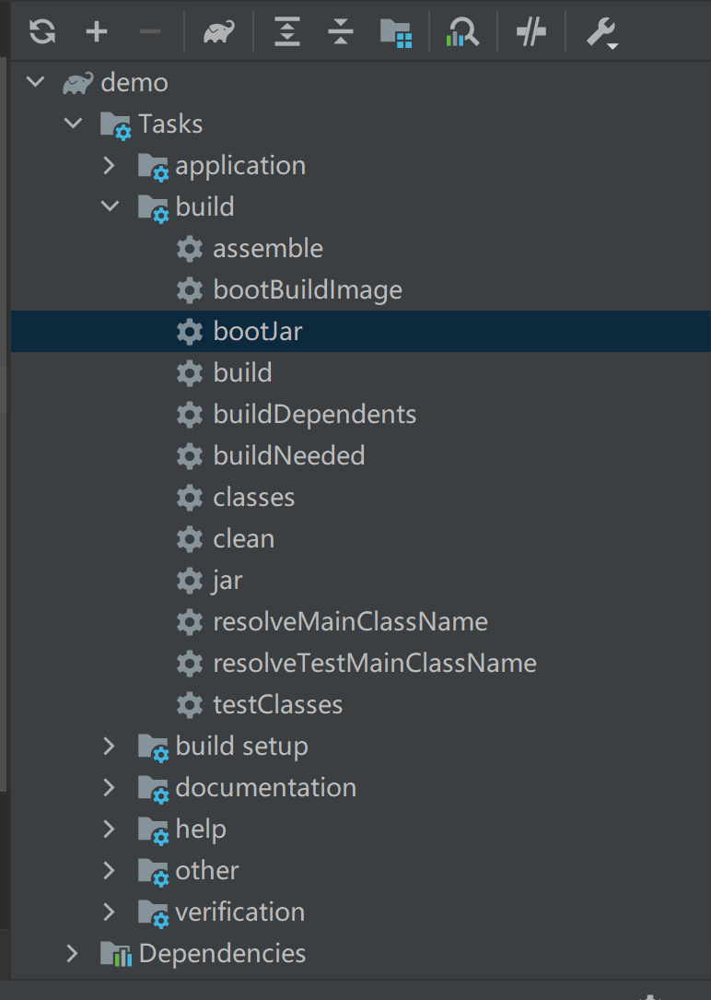

**怎么跑**：

首先需要配一下redis，这里采取的方式是k8s部署一个redis

找到redis文件夹下面的文件，依次

```bash
kubectl apply -f redis-configmap.yaml
kubectl apply -f redis-deploy.yaml
kubectl apply -f redis-svc.yaml
```

接下来

```bash
kubectl get svc
```

拿到redis的ip，接着去把**src/resources**文件夹下的**redisson\-dev\.yaml**里面的singleServerConfig\.address中间的ip改成对应的ip。端口号理论上不动就行。


接下来，打包。这里我没有写gradle的build命令（有空研究一下），可以先在本地用idea打包。具体的打包方式是界面右边点击gradle，找到build下面的bootjar，点击一下：



然后把整个文件夹放到机子里，在路径下面:

```bash
docker build . -t hello-service:2023
kubectl apply -f hello-deployment.yaml
kubectl apply -f hello-service.yaml
```

所以说写的很丑陋（这个jar包的位置我甚至没改过，交给idea生成的位置），Dockerfile是要改一改的。